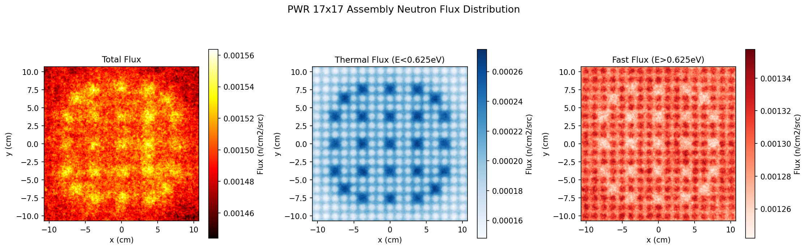

# OpenMC PWR Pin Cell & Assembly Study

Monte Carlo neutron transport simulations of a PWR pin cell and 17×17 fuel assembly using OpenMC 0.15.3.  
Conducted as part of a computational nuclear engineering portfolio for PhD applications.

## Environment

- OpenMC 0.15.3 (conda-forge)
- Nuclear data: ENDF/B-VIII.0 HDF5
- Python 3.11 / WSL2 Ubuntu

---

## Simulations

### 1. Baseline Pin Cell (`pin_cell.py`)
Infinite pin cell model of a Westinghouse 17×17 PWR fuel assembly unit cell.

| Parameter | Value |
|-----------|-------|
| Fuel | UO₂, 3.1 wt% enriched |
| Cladding | Zircaloy-4 |
| Coolant | H₂O at 0.71 g/cm³ (325°C, 155 bar) |
| Fuel radius | 0.4096 cm |
| Clad outer radius | 0.4750 cm |
| Pin pitch | 1.26 cm |

**Result:** k-infinity = 1.340 ± 0.001

---

### 2. Enrichment Sensitivity Study (`enrichment_study.py`)
k-infinity as a function of U-235 enrichment (1.0 – 19.75 wt%).

| Enrichment (wt%) | k-infinity | Note |
|-----------------|------------|------|
| 1.00 | 1.081 ± 0.001 | |
| 2.00 | 1.278 ± 0.001 | |
| 3.10 | 1.366 ± 0.001 | Typical PWR |
| 5.00 | 1.441 ± 0.001 | LEU upper limit |
| 19.75 | 1.574 ± 0.001 | HALEU (SMR) |

**Finding:** k-infinity increases with enrichment with diminishing returns above 5 wt%.

---

### 3. Void Coefficient Analysis (`void_coefficient.py`)
k-infinity as a function of coolant void fraction (0 – 99.9%).

| Void Fraction (%) | Coolant Density (g/cm³) | k-infinity |
|------------------|------------------------|------------|
| 0.0 | 0.750 | 1.377 ± 0.001 |
| 5.3 | 0.710 | 1.366 ± 0.001 |
| 46.7 | 0.400 | 1.235 ± 0.001 |
| 86.7 | 0.100 | 0.899 ± 0.001 |
| 99.9 | 0.001 | 0.652 ± 0.001 |

**Finding:** Negative void coefficient confirmed — k-infinity decreases monotonically  
with increasing void fraction, demonstrating PWR inherent safety.

---

### 4. 17×17 Fuel Assembly (`assembly.py`)
Full Westinghouse 17×17 assembly model with 264 fuel pins and 25 guide tubes.

| Parameter | Value |
|-----------|-------|
| Fuel pins | 264 |
| Guide tubes | 25 (ARO condition) |
| Assembly pitch | 21.42 cm |
| Particles | 3,000,000 (20,000 × 150 active batches) |

**Result:** k-effective = 1.393 ± 0.001  
**vs Pin Cell:** Δk = +0.052 (spectral effect from guide tube water)

---

### 5. Neutron Flux Distribution (`flux_plot.py`)
2D mesh tally (170×170) of total, thermal, and fast neutron flux across the assembly.



**Key observations:**
- **Thermal flux** peaks at guide tube locations — water moderates fast neutrons locally
- **Fast flux** peaks at fuel pin locations — fission neutrons born here
- Thermal/fast flux patterns are spatially anti-correlated, confirming moderation physics

---

## Key Physics Concepts Demonstrated

- Monte Carlo eigenvalue calculation (k-infinity / k-effective)
- Infinite lattice approximation with reflective boundary conditions
- Effect of U-235 enrichment on neutron multiplication (1% → 19.75%)
- Negative void coefficient as a passive safety mechanism
- Spectral effect of guide tubes in PWR assemblies
- Thermal vs fast neutron flux spatial distribution via mesh tally

## How to Run

```bash
conda activate openmc
python pin_cell.py           # Phase 2: baseline
python enrichment_study.py   # Phase 2-A: enrichment sensitivity
python void_coefficient.py   # Phase 2-B: void coefficient
python assembly.py           # Phase 3: 17x17 assembly
python flux_plot.py          # Phase 3: flux visualization
```

## References

- OpenMC Documentation: https://docs.openmc.org
- ENDF/B-VIII.0 Nuclear Data Library (Brookhaven National Laboratory)
- Westinghouse AP1000 Design Control Document
